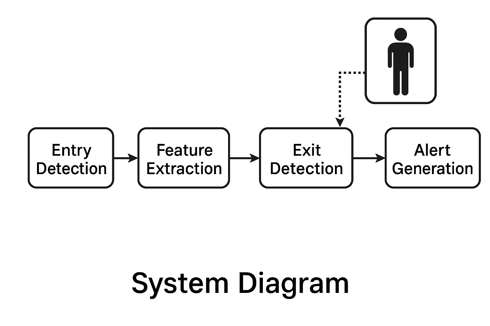

# Emergency Detection System for Public Restrooms

This repository contains the codes and resources for the project:
> **"Emergency Detection System for Public Restrooms"**
>
> Junho Lee, Seunghyeon Suh
>
> Department of Convergence Electronic Engineering, Hanyang University

Our system is designed to automatically detect emergency situations in public restrooms while preserving user privacy, based on advanced real-time computer vision technologies.

We would like to thank the developers of YOLO, SORT, OpenCV, and MediaPipe Pose, whose works inspired and supported this project.

## Changelog

[24/04/26] Initialize repository and upload core project codes. 

## :blue_book: Project Report
For a detailed explanation of the project background, system design, and experiment results, refer to the forthcoming **Project Report**.

## 1. Setup

The codes have been tested under Python 3.8 with a single NVIDIA RTX 4070 SUPER GPU.

### 1) Set up dependencies
It is recommended to use Anaconda to manage the environment.

~~~bash
conda create -n emergency_env python=3.8
conda activate emergency_env
conda install pytorch torchvision torchaudio pytorch-cuda=12.1 -c pytorch -c nvidia
conda install scikit-learn pillow tqdm
~~~

Make sure that `torch.cuda.is_available()` returns `True`.

### 2) Download or prepare dataset
- Preprocessed training samples must be prepared in `.pkl` format, including image paths and corresponding labels (categories and colors).

## 2. Quick Start (Training & Evaluation)

### 1) Training the model
~~~bash
python train.py
~~~
- This will start training the MobileNetV2-based multi-output model.
- Checkpoints are saved automatically.

### 2) Evaluating the model
~~~bash
python evaluate.py
~~~
- Reports per-category and per-color classification accuracy for "Top", "Bottom", "Outer", and "Dress".

## 3. System Features

| Stage | Description | Applied Technology |
|:-----|:------------|:-------------------|
| Person Detection and Tracking | Real-time recognition and tracking of individuals entering/exiting the restroom | YOLO with SORT, OpenCV |
| Entry Information Collection | Capture clothing color, body shape, and carried objects | OpenCV (HSV color space), MediaPipe Pose |
| Exit Information Collection | Same as entry phase | OpenCV (HSV color space), MediaPipe Pose |
| Information Comparison | Compare entry and exit feature vectors to identify abnormalities | Multi-criteria feature matching |

## 4. Anticipated Challenges
- Diverse clothing colors
- Simple/monotonous clothing colors
- Occlusion of clothing or carried objects
- High memory consumption
- Potential matching inaccuracies in complex environments

## 5. Expected Benefits
- Early detection and reporting of emergencies, ensuring rapid rescue response (golden time security).
- Reduced monitoring burden, enabling proactive rather than reactive responses.
- Enhanced public safety in restrooms without intrusive continuous surveillance.

## :camera: System Diagram

*Figure 1. System Flow: From entry detection to abnormality matching and emergency notification.*

## Technology Stack
- Python
- PyTorch
- OpenCV
- YOLOv5
- SORT (Simple Online and Realtime Tracking)
- MediaPipe Pose Estimation

## Contact
- Junho Lee: oran03@hanyang.ac.kr
- Seunghyeon Suh: logi1000@hanyang.ac.kr

